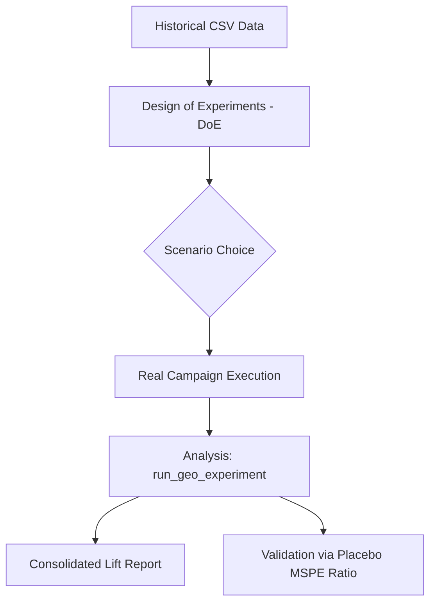

# RealLift Framework: High-Precision Causal Inference for Geo Experiments
**Author: Roberto Junior**

> *Master Documentation - Architecture and Philosophy Guide*

---

## 1. The Challenge of Geographic Incrementality

In modern Marketing, measuring the "Lift" (incremental impact) of campaigns on channels that do not allow individual tracking (such as TV, Outdoor, or Branding Campaigns on Social Media) requires statistical rigor. **RealLift** was designed to transform the complexity of Synthetic Control econometrics into a pragmatic, auditable, and highly intuitive workflow.

Our philosophy is based on: **"Pragmatism over Pure Academicism"**. While literature focuses on models, RealLift focuses on the *experiment lifecycle*.

---

## 2. The Three Pillars of RealLift

The framework is organized into three layers of defense against noise and bias:

### A. Auditable Planning (DoE)
Before any investment, RealLift uses the **SER (Synthetic Error Ratio)** engine to proactively filter out volatility. 
- **Intelligent Selection**: The ranking of scenarios (10%, 20%, 30% treatment) chooses geos that co-move, avoiding "Zombie Controls."
- **Technical Audit**: Provides full transparency over the *Donor Pool* (which cities compose the control and what their weight is) and Market Coverage.

### B. Causal Inference (Synthetic Control)
The mathematical core for calculating impact on real data.
- **SCM with Convex Intercept**: An approach that corrects the level bias between the treated unit and the synthetic control without violating the interpretability of positive weights ($\sum w = 1$).
- **Curatorship via ElasticNet**: A prior relevance filter that purifies the donor pool, keeping only the series that demonstrate genuine signal.

### C. Confidence Validation (Significance)
The final layer of statistical proof for the captured profit.
- **MSPE Ratio (Robust Placebo)**: A methodology that normalizes intervention error by each geo's historical error, ensuring a reliable empirical p-value even in noisy markets.
- **Bootstrap Intervals**: Uncertainty quantification based on non-parametric re-sampling, providing upper and lower bounds for absolute and percentage lift.

---

## 3. Execution Workflow

---

## 4. Strategic Advantages

### Corporate Transparency
By maintaining Convex Weights ($\sum w = 1$), RealLift allows executives to understand exactly the composition of the control group. There is no "black box": incremental profit is derived from a direct and explainable comparison.

### Operational Freedom
Through the ElasticNet filter (Pool Purification), RealLift frequently uses fewer geos in the control group than classic SCM. This frees up to **40-50% of regions** to operate freely with other campaigns without contaminating the main experiment.

---

## Next Steps
To understand the mathematics behind our selection metric, read the technical article: [Synthetic Error Ratio](./synthetic_error_ratio.md).
