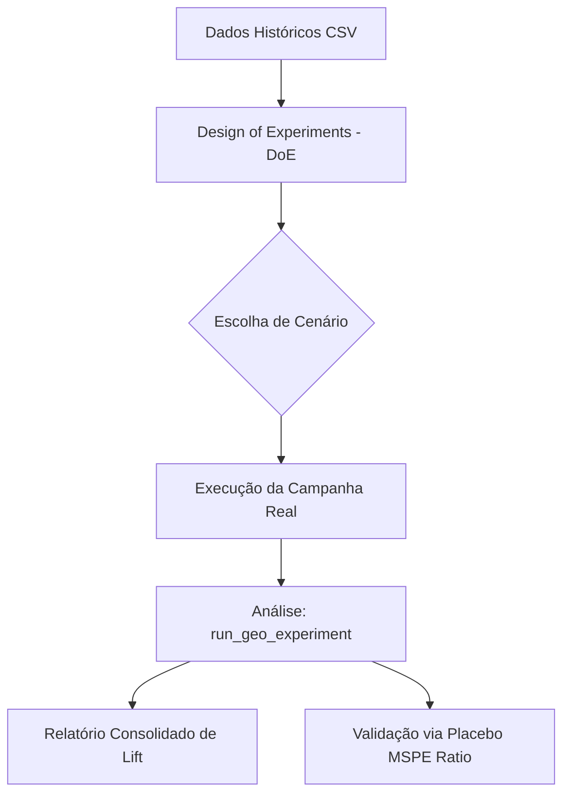

# RealLift Framework: Inferência Causal de Alta Precisão para Geo Experiments
**Autor: Roberto Junior**

> *Documentação Master - Guia de Arquitetura e Filosofia*

---

## 1. O Desafio da Incrementalidade Geográfica

No Marketing moderno, medir o "Lift" (impacto incremental) de campanhas em canais que não permitem rastreio individual (como TV, Outdoor ou Campanhas de Branding em Redes Sociais) exige rigor estatístico. O **RealLift** foi concebido para transformar a complexidade da econometria de Controles Sintéticos em um workflow pragmático, auditável e altamente intuitivo.

Nossa filosofia baseia-se em: **"Pragmatismo sobre Academismo Puro"**. Enquanto a literatura foca em modelos, o RealLift foca no *ciclo de vida do experimento*.

---

## 2. Os Três Pilares do RealLift

O framework organiza-se em três camadas de defesa contra ruído e viés:

### A. Planejamento Auditável (DoE)
Antes de qualquer investimento, o RealLift usa o motor **SER (Synthetic Error Ratio)** para filtrar proativamente a volatilidade. 
- **Seleção Inteligente**: O ranking de cenários (10%, 20%, 30% de tratamento) escolhe geos que co-movimentam, evitando "Controles Zumbis".
- **Auditoria Técnica**: Fornece transparência total sobre o *Donor Pool* (quais cidades compõem o controle e qual seu peso) e a Cobertura de Mercado.

### B. Inferência Causal (Synthetic Control)
O núcleo matemático para cálculo de impacto sobre os dados reais.
- **SCM com Intercepto Convexo**: Uma abordagem que corrige o viés de nível entre a unidade tratada e o controle sintético, sem violar a interpretabilidade dos pesos positivos ($\sum w = 1$).
- **Curadoria via ElasticNet**: Um filtro prévio de relevância que purifica o pool de doadores, mantendo apenas as séries que demonstram sinal genuíno.

### C. Validação de Confiança (Significância)
A camada final de prova estatística para o lucro capturado.
- **Razão MSPE (Placebo Robusto)**: Metodologia que normaliza o erro da intervenção pelo erro histórico de cada geo, garantindo um p-valor empírico confiável mesmo em mercados ruidosos.
- **Intervalos de Bootstrap**: Quantificação de incerteza baseada em re-amostragem não-paramétrica, fornecendo limites superiores e inferiores para o lift absoluto e percentual.

---

## 3. Workflow de Execução

---

## 4. Vantagens Estratégicas

### Transparência Corporativa
Ao manter Pesos Convexos ($\sum w = 1$), o RealLift permite que executivos entendam exatamente a composição do grupo de controle. Não há "caixa preta": o lucro incremental é derivado de uma comparação direta e explicável.

### Liberdade Operacional
Através do filtro ElasticNet (Purificação do Pool), o RealLift frequentemente utiliza menos geos no grupo de controle do que o SCM clássico. Isso libera até **40-50% das regiões** para operarem livremente com outras campanhas sem contaminar o experimento principal.

---

## Próximos Passos
Para entender a matemática por trás da nossa métrica de seleção, leia o artigo técnico: [Synthetic Error Ratio](./synthetic_error_ratio.md).
